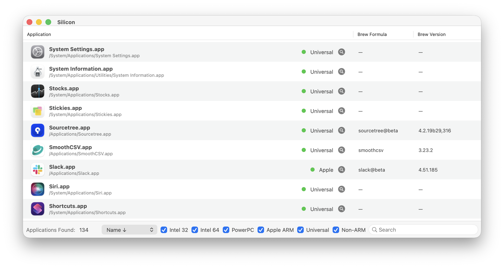
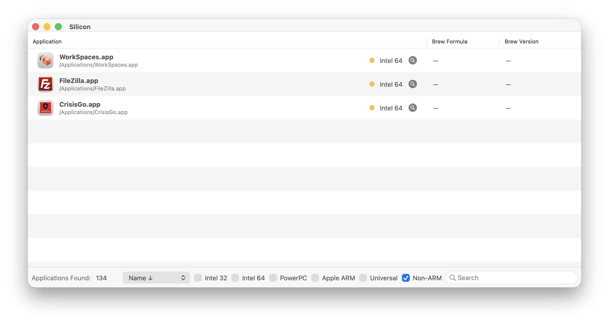
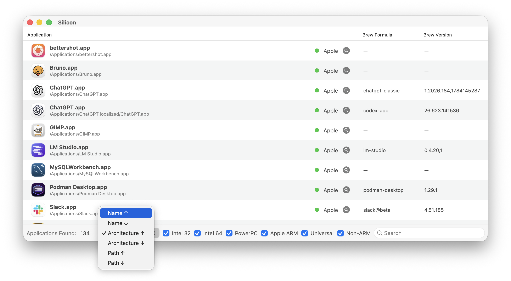
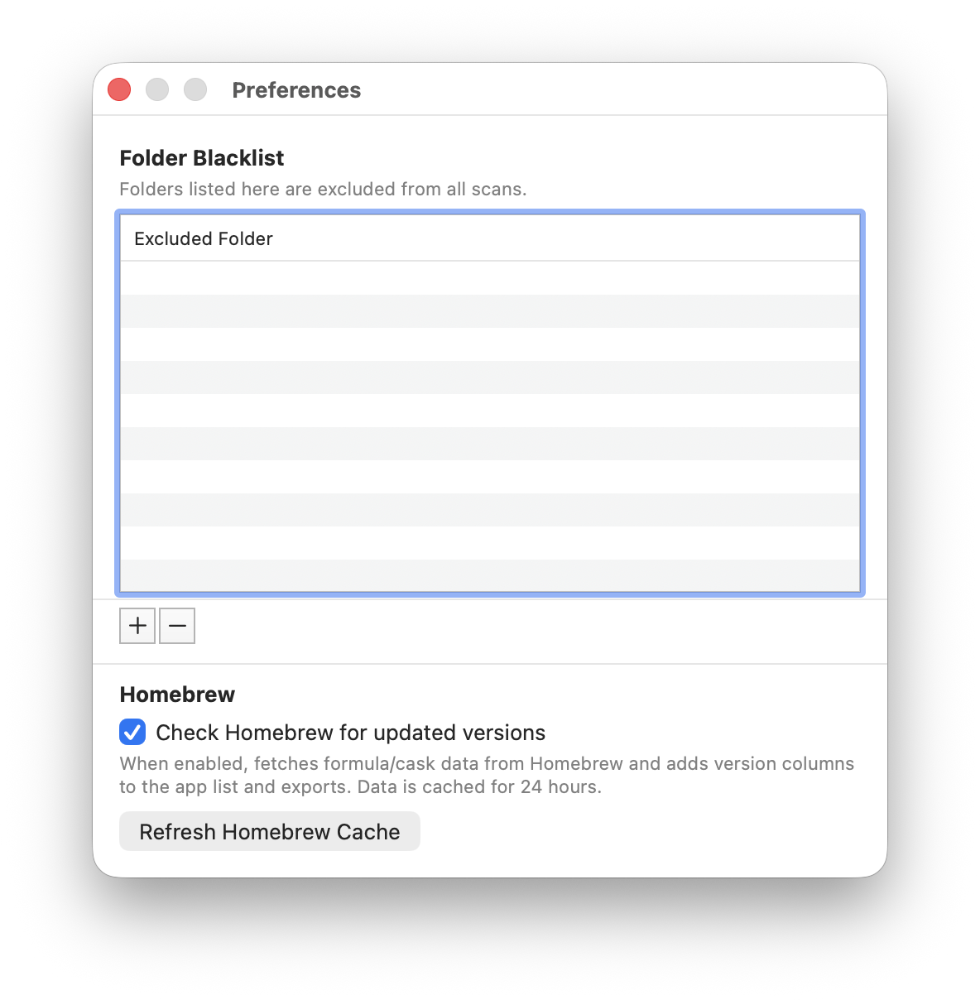
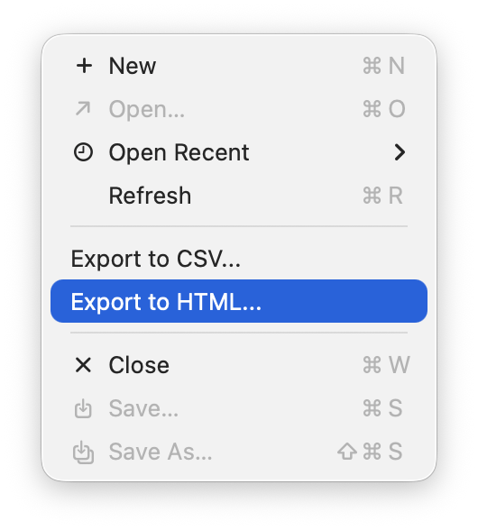

Silicon
=======

[](https://github.com/byronjones-elsevier/Silicon/actions/workflows/ci.yaml)
[](https://github.com/byronjones-elsevier/Silicon/releases)
[](https://github.com/byronjones-elsevier/Silicon/issues)


About
-----

Identify the binary architecture of every app installed on your Mac:

Silicon scans `.app` bundles, parses their Mach-O executables, and classifies each application as Apple Silicon (ARM), Universal, Intel 64, Intel 32, or PowerPC — or any combination. It optionally cross-references Homebrew to show the latest available version alongside each installed app.











Features
--------

- **Architecture detection** — Apple Silicon, Universal, Intel 64/32, PowerPC
- **Flexible filtering** — independent checkboxes for each architecture, plus Universal and Non-ARM filters
- **Homebrew version lookup** — compares installed apps against Homebrew cask and formula data (24-hour cache)
- **Export** — CSV and HTML exports with architecture, version, bundle ID, path, and optional Homebrew columns
- **Folder blacklist** — exclude directories from scans via Preferences
- **Sort options** — by name, architecture, or path (ascending/descending)

Installation
------------

Download the latest release from the [Releases page](https://github.com/byronjones-elsevier/Silicon/releases) and move `Silicon.app` to your `/Applications` folder.

Or build from source with Xcode and the local Makefile targets below.

Building From Source
--------------------

Prerequisites:

- Xcode with command line tools installed
- Git submodules initialized

Fetch the required submodules first:

```sh
make submodules
```

Common local build commands:

```sh
make build        # Build Release for the host/default architecture
make app-intel    # Build and stage build/dist/x86_64/Silicon.app
make app-arm      # Build and stage build/dist/arm64/Silicon.app
make dmg-intel    # Create build/dist/Silicon-<version>-x86_64.dmg
make dmg-arm      # Create build/dist/Silicon-<version>-arm64.dmg
make dist         # Create both Intel and Apple Silicon DMGs
make clean        # Remove build output
```

Local builds are unsigned by default so they work without a developer
certificate:

```sh
make dist SIGNING=unsigned
```

Other signing modes:

```sh
make dist SIGNING=adhoc
make dist SIGNING=automatic
```

Apple Silicon builds use `MACOSX_DEPLOYMENT_TARGET=11.0` by default because
macOS arm64 apps require Big Sur or later. Output is written under
`build/dist/`. Additional build details are in [BUILDING.md](BUILDING.md) and
[Engineering.md](Engineering.md).

Changelog
---------

### v1.1.0
- Added Universal and Non-ARM architecture filter checkboxes
- Added Homebrew version lookup (cask + formula, 24-hour cache)
- Added Brew Formula and Brew Version columns to table and exports
- Fixed version information missing from CSV/HTML exports
- Added GitHub Actions CI and release workflows

### v1.0.5
- Bug fixes and stability improvements

### v1.0.4
- Initial public release

License
-------

Project is released under the terms of the MIT License.

Repository Infos
----------------

    Owner:          DigiDNA SARL
    Web:            www.imazing.com
    Blog:           blog.imazing.com
    Twitter:        @DigiDNA
    GitHub:         github.com/DigiDNA

    Fork Owner:     Byron Scott Jones
    Fork Github:    ByronScottJones/silicon

# AI Disclaimer
This application was updated with the assistance of Claude.ai
The code was reviewed and tested by Byron Scott Jones, a real actual human developer with nearly 50 years of experience. If you do not like that I used AI, tough.

In the words of Bender:


